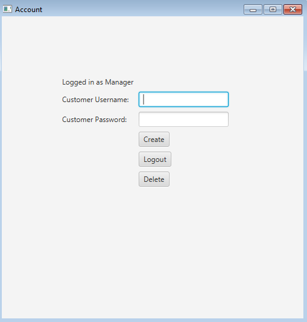

# Bank Manager

This Java application has two main functions:

1. Allow users to complete bank related tasks (ie. withdraw funds, deposit funds etc.) while saving their data related to their username, password, account balance, and level using text files;

2. Allow admins to manage the users.

The application takes advantage of the state design pattern in order to increase cohesion while minimizing coupling. It also allows for the easy access of more levels in the future due to it's modularization. See the UML class diagram below:

See also the UML use case diagram here:

The first view of the application is a simple login screen, whether you login as an admin or the typical user, your interface will be different.

Here is the admin interface:

The admin can add new users to the application. Each user starts with a balance of $100 and a level rating of silver. The user's state is then saved into a text file when the job terminates.

Here is the user interface:

The user can deposit money, withdraw money, or make a purchase. Depending on the user's level, they may be taxed more money for a specific purchase. The application already has two users pre-installed: Albert and Jenny. You can check their .txt files locted in the BankAccount folder for their information.